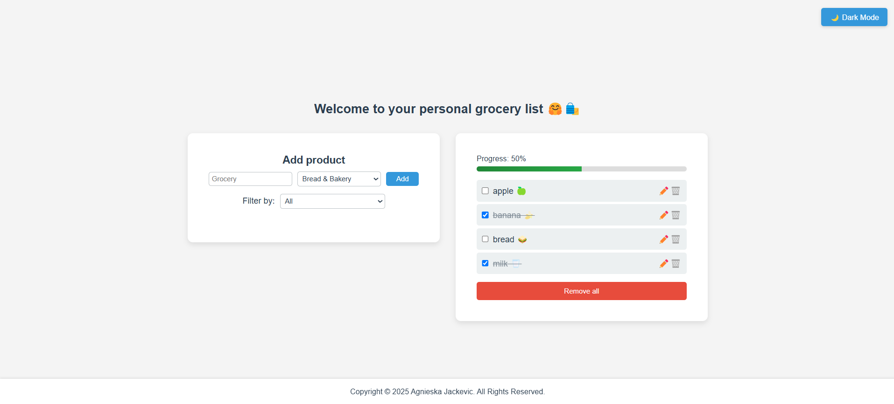
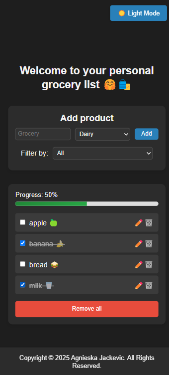

# Grocery List Web App

A sleek, responsive grocery list app built with HTML, CSS, and JavaScript — no frameworks, no backend! Designed to help you track your shopping with features like item filtering, dark mode, progress tracking, and local persistence.

### Features

- Add/Edit/Delete Items — Easily manage your grocery items.
- Filter by Category — See only what you need.
- Mark as Purchased — Check off items and visually separate them.
- Progress Bar — Tracks percentage of purchased items.
- Strike-through Style — Purchased items are visually marked.
- LocalStorage Support — Everything is saved between sessions.
- Dark Mode Toggle — Switch between light and dark themes.
- SweetAlert2 Integration — Beautiful alert popups.
- Responsive Layout — Works on mobile, tablet, and desktop.

### Links

- Code URL: (https://github.com/agneja00/Grocery-List)
- Live Site URL: (https://grocery-list-beryl.vercel.app/)

### Built with

- **HTML5** – structure and semantic layout.
- **CSS** – modern responsive styling with flexbox and media queries.
- **CSS Variables** – for theme support (dark/light mode).
- **JavaScript** – DOM manipulation, logic, and localStorage management.
- **SweetAlert2** – elegant alert messages.
- **LocalStorage API** – persistent data storage in the browser.
- **Vercel** – deployment platform for fast, global hosting and automatic CI/CD integration.

## Author

- Website - [Agnieska Jackevic] (https://web-portfolio-agneja00.vercel.app/)
- Linkedin - [Agnieska Jackevic] (https://www.linkedin.com/in/agnieska-jackevic/)

